<!-- _class: title -->

# 入退場管理システム
## 第37回 模擬国連会議全日本大会

Discord認証 × QRコードによる受付システム

---

# 目次

1. 導入の背景 — 従来の課題と解決策
2. 参加者向け — QRコード取得と受付の流れ
3. スタッフ向け — スキャナーとDiscordコマンド
4. FAQ

---

# 従来の受付の課題

### 混雑・時間
- 7会議の受付が一箇所に集中し、廊下まで溢れる
- スプレッドシートに手動記録、一人ずつ名前を確認して入力

### 担当者の固定・状況把握
- 会議フロントが受付を兼任、担当者不在時の対応が困難
- リアルタイムでの出席確認ができない

---

# 新システムによる解決

| 課題 | 解決策 |
|------|--------|
| 受付時間 | QRスキャンで即完了。手入力不要 |
| 担当者固定 | スマホがあれば誰でも受付可能 |
| 状況把握 | Discordコマンドで即時確認 |

---

# システム構成

<center>

新規アカウント作成は不要。既存のDiscordアカウントを使用。



</center>

---

<!-- _class: title -->

# 参加者向け

---

# 事前準備 (1) システムにアクセス

受付システムのURLを開く: https://ajmun37.re4lity.com

---

# 事前準備 (2) Discordでログイン

「Discordでログイン」をクリック

**PCの場合**
Discordアプリが自動起動し、ワンクリックで認証完了。パスワード入力不要。

**スマホの場合**
Discordアプリが開く。事前にアプリでログインしておくとスムーズ。

---

# 事前準備 (3) QRコードを取得

表示されたQRコードを保存

- 各自専用のQRコードが発行される
- スクリーンショットで保存可能
- 画面の明るさを上げておくとスキャンしやすい

---

# 当日の受付

1. 会場に到着
2. スマホでQRコードを表示（保存した画像でも可）
3. 受付スタッフにQRコードを提示
4. スキャン完了

所要時間: 約3秒

---

<!-- _class: title -->

# スタッフ向け

---

# スキャナーの使い方

1. スタッフ用ページにアクセス
   - URL: https://ajmun37.re4lity.com/staff
   - Cloudflare Accessで保護
2. カメラを許可
3. 参加者のスマホ画面にカメラを向ける

---

# スキャン結果の見方

| ステータス | 表示内容 |
|-----------|---------|
| 成功 | ユーザー名、アバター、属性、所属サーバー |
| 重複 | 同上 + 「本日入場済み」メッセージ |
| エラー | エラーメッセージのみ |

- 3秒後に自動リセット / ダブルタップで即時リセット
- 振動フィードバックはAndroidのみ（iOS非対応）

---

# Discordコマンド（会議フロント/スタッフ向け）

organizer（会議フロント）以上のロールで実行可能

| コマンド | 説明 |
|---------|------|
| `/attendance status` | 出席済み / 未出席の人数 |
| `/attendance present` | 出席済み一覧 |
| `/attendance absent` | 未出席一覧 |

※ organizerは自分の所属サーバーのみ、staff/adminは全サーバーを確認可能

---

# Discordコマンド（スタッフ/管理者向け）

| コマンド | 必要権限 | 説明 |
|---------|---------|------|
| `/system sync` | staff以上 | メンバー情報を同期 |
| `/system show` | admin | 現在の設定を表示 |
| `/system config` | admin | 設定を変更 |
| `/system delete` | admin | 設定を削除 |

---

# コマンド実行例

```
出席状況 (2025-12-27)

出席: 45名
未出席: 55名
━━━━━━━━━━━━━━━━━━
合計: 100名
```

---

# FAQ

### QRコードを削除してしまった
再度システムにログインすれば同じQRコードが表示される。

### ネットがつながらない場所では？
事前にスクリーンショットを保存しておけば、オフラインでも表示可能。

### QRコードを他人に使われたら？
QRコードはDiscordアカウントと紐付き。他人が使用しても本人の名前で登録されるため不正使用のメリットがない。

---

# まとめ

### 参加者
1. 事前にシステムにログイン
2. QRコードを保存
3. 当日、受付でスキャン

準備時間: 約1分

### スタッフ
1. スタッフ用ページを開く
2. カメラを許可
3. QRコードをスキャン

---

<!-- _class: title -->

# Appendix

---

# 技術仕様

| 項目 | 詳細 |
|------|------|
| 認証 | Discord OAuth2 |
| QRコード | SHA256署名付きトークン |
| データベース | SQLite |
| サーバー | Oracle Cloud (無料枠) |
| セキュリティ | Cloudflare Access |

運用コスト: ドメイン代のみ（年間約1,000〜2,000円）

---

# 期待される効果

| 指標 | 従来 | 新システム |
|------|------|-----------|
| 受付時間/人 | 30秒〜1分 | 約3秒 |
| 受付担当者 | 会議フロント限定 | 誰でも |
| 出席確認 | スプシを目視 | コマンド一発 |
| 待ち行列 | 廊下まで溢れる | ほぼ解消 |

---

# リンク

| ページ | URL |
|--------|-----|
| メイン | https://ajmun37.re4lity.com |
| 使い方ガイド | https://ajmun37.re4lity.com/guide |
| スタッフ用スキャナ | https://ajmun37.re4lity.com/staff |
| 利用規約 | https://ajmun37.re4lity.com/terms |
| プライバシーポリシー | https://ajmun37.re4lity.com/privacy |

---

<!-- _class: title -->

# 以上
